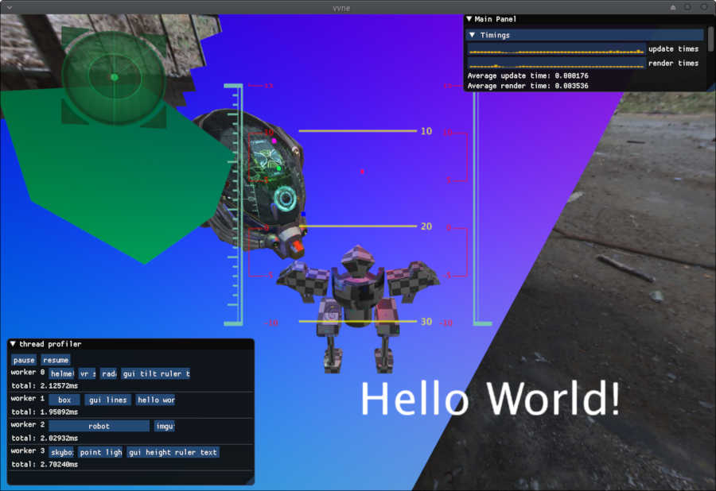

# vvne

There are a lot of publicly available engines / demos on github which use vulkan and gltf2.0, but as far as I can tell none of them keeps the implementation *stl-free*. I'm paranoid about compile times and sadly only way to archive that is by skipping what state of the art c++ has to offer.

Project aims to recreate a [very inspiring muv luv gif](https://thumbs.gfycat.com/HelplessRealAlbacoretuna-size_restricted.gif) as best as possible.

Current preview (still a veeeery long road ahead)

### Features
- handmade gltf2.0 glb model importer (nodes, animations, skinning)
- integrated imgui
- support for both windows (mingw) and linux
- custom vulkan memory allocators
- hdr skybox (although not used yet)
- PBR with IBL (huge thanks to Sascha Willems vulkan examples and https://learnopengl.com/PBR/Theory)
- MSAA

### Used C++ subset
- no stl
- no rtti
- no exceptions
- minimal use of templates
- designated initializers (available in C++ with GCC 8.1 c++2a flag)

### Dependencies
- imgui (included with project)
- SDL2 (any version with SDL_vulkan header)
- vulkan-1.dll / libvulkan.so

### How to build?
Modification inside CMakeLists.txt are needed. Depending on which platform is used different paths for vulkan and SDL dynamic libraries may be required.

Shaders can be build using assets/make_shaders scripts, but path to glslangvalidator need to be substituted

GCC 8.1 is nessesary since a brand new standard is used.

Binary should be run inside "bin" folder.

One asset which was not included (but can be found in releases) is "Old Industrial Hall" pack from http://www.hdrlabs.com/sibl/archive.htm.
Texture itself weights about 4mb so it wasn't the best idea to include it with repo.
