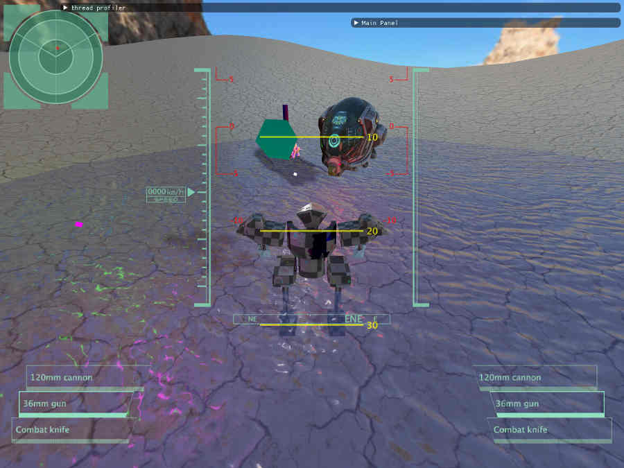

# vvne

Project aims to recreate a [very inspiring muv luv gif](https://thumbs.gfycat.com/HelplessRealAlbacoretuna-size_restricted.gif) using [subset of c++](https://gist.github.com/bkaradzic/2e39896bc7d8c34e042b), SDL and vulkan.

Current preview (still a veeeery long road ahead)

### Features
- Handmade gltf2.0 glb model importer (nodes, animations, skinning)
- Integrated imgui
- Support for both windows (mingw) and linux
- Custom memory allocators (host and device)
- PBR with IBL (huge thanks to Sascha Willems vulkan examples and https://learnopengl.com/PBR/Theory)
- Signed distance field font rendering
- Multithreaded rendering / job system
- Cascaded shadow mapping

### TODO - engine
short distance goals:
- Shader preloading and reuse
- Small object suballocators (x < 1kB < y < 256kB)
- Texture LoDs generation
- Particle system (engine boost effect)

long distance goals:
- Editor for level design
- Global illumination (got to understand spherical harmonics and light probes first)
- Occluders (AABB trees)
- Parallelized pipeline creation (postponed since now it takes ~50ms in non-parallel form)

### TODO - game
short distance goals:
- Small AI horde patrol throughout level
- Maintenence create drop call
- Shooting and melee
- Height calculation rework

### long distance goals:
- AI combat
- better model and animations (while only using keyframes from glb)

### Dependencies
- GCC at least 8.1 (to support C++2a)
- SDL2 (any version with SDL_vulkan header)
- lunarg vulkan sdk

### How to build?
1. Change include paths inside CMakeLists.txt to suit development environment
2. Change dll paths for SDL and vulkan
3. Change glslangvalidator inside 'shaders/make_shaders.bat/.sh'
4. Install 'hashlib' library for python in use
5. use scripts for shaders, cmake for game
6. run binaries inside 'bin' folder
